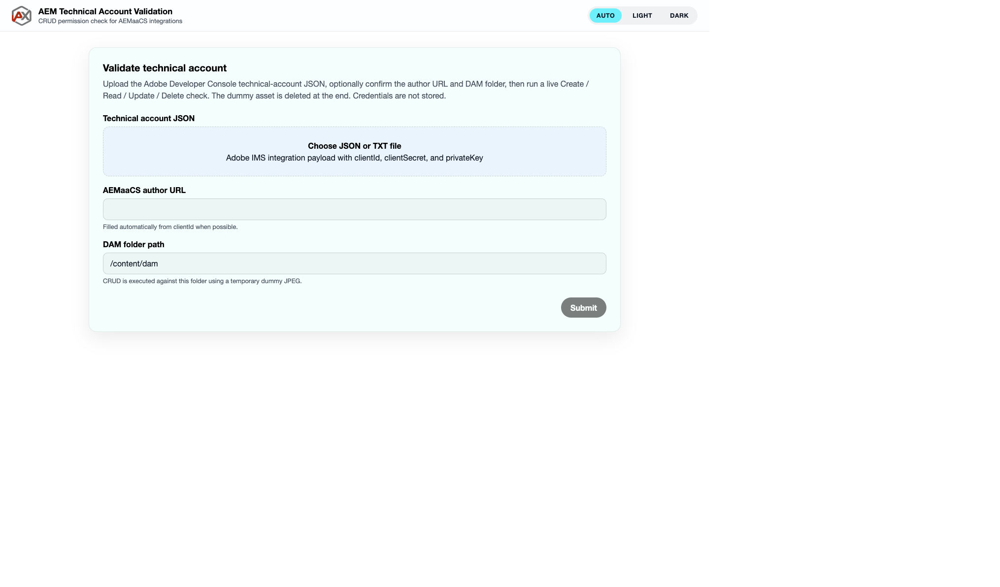

<p align="center">
  <picture>
    <source media="(prefers-color-scheme: dark)" srcset="public/images/AdobeXPLogo/AdobeXPLogoMinified-DARK.png" />
    
  </picture>
</p>

<h1 align="center">AEM Technical Account Validation</h1>

<p align="center">
  AdobeXP single-page app that checks whether an AEMaaCS technical account can Create, Read, Update, and Delete assets in DAM.
</p>

<p align="center">
  
</p>

## Run

```bash
npm install
npm run start
```

Open [http://localhost:3000](http://localhost:3000).

## Use

1. Upload the Adobe Developer Console technical-account JSON (`.json` or `.txt`).
2. Confirm the author URL (auto-filled from `clientId` when it matches `cm-p<program>-e<environment>-…`).
3. Set the DAM folder path (default `/content/dam`).
4. Click **Submit**. The report appears on the same page.

The server exchanges a JWT for an IMS token, then runs Direct Binary Upload, metadata update, original-rendition download, and delete. A bundled dummy JPEG is used and removed afterward. Credentials are not written to disk.
